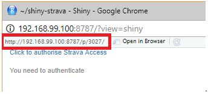

# shiny-strava
`shiny-strava` is a web application built using `shiny` to display an athlete's workout data in an interactive dashboard. The app uses the `rStrava` R package to connect to Strava's web API to download an athlete's data.

An example of the app is hosted at http://hypercubeza.ddns.net/shiny-strava/

## Layout

shiny-strava uses a traditional shinydashboard layout with header, sidebar and main panel

### Controls

Controls on the sidebar can be used to limit activities by data and type

### Map

A map of activity tracks is displayed using leaflet. Controls are available to limit tracks within a radius of the start of one of the activities

### Chart

An interactive chart allows the user to view weekly or monthly stats.

## Instructions

1. Pull the repo
1. Ensure global.R can be sourced (all packages are available)
1. Set all the environment variables appropriately in global.R
1. NOTE: To specify the **strava_app_url** environment variable you can just click `Run App` in RStudio and it will be the URL in the address bar (see example below). When deploying the app to shinyapps.io or a shiny server you will need to specify the exact app URL.

1. Click the link **Click to Authorise Strava access**
1. Once you authenticate you will be redirected to the app and it will start downloading your activities and display them in a data.table.

