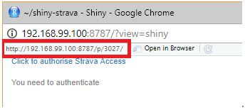

# shiny-strava
A project to showcase Strava data using the R package rStrava and Shiny

## Instructions

1. Pull the repo
1. Ensure global.R can be sourced (all packages are available)
1. Set all the environment variables appropriately in global.R
1. NOTE: To specify the **strava_app_url** environment variable you can just click `Run App` in RStudio and it will be the URL in the address bar (see example below). When deploying the app to shinyapps.io or a shiny server you will need to specify the exact app URL.

1. Click the link **Click to Authorise Strava access**
1. Once you authenticate you will be redirected to the app and it will start downloading your activities and display them in a data.table.
